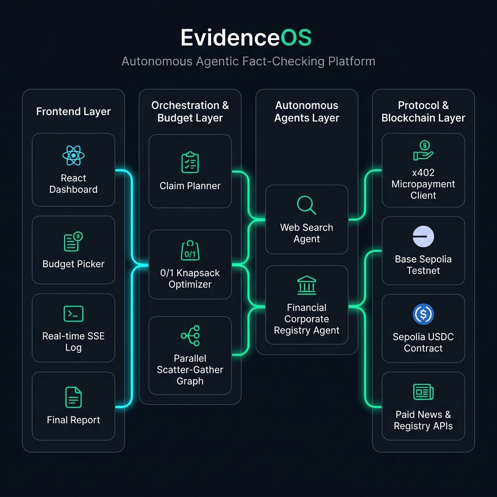
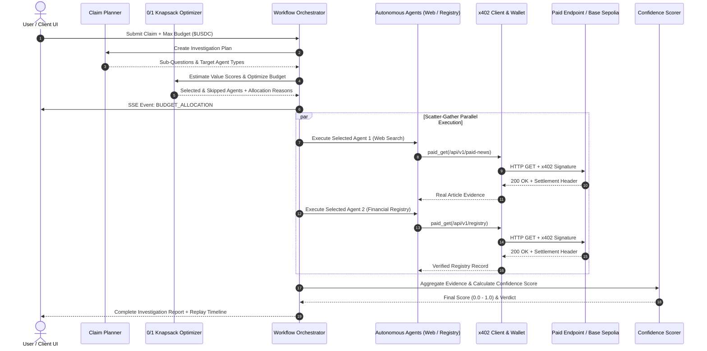

# EvidenceOS Technical Architecture Specification

## 1. System Overview

**EvidenceOS** is an autonomous agentic fact-checking and evidence-verification platform. It empowers AI agents to autonomously evaluate factual claims by acquiring verified, paywalled evidence on-demand using the **x402 Micropayment Protocol** over the **Base Sepolia EVM Testnet**.

### Key Innovations
- **0/1 Knapsack Evidence Budgeting**: Optimizes value density vs. cost under user-defined USDC spend limits.
- **Parallel Scatter-Gather Agent Execution**: Concurrent agent dispatch (`asyncio.gather`) to reduce latency while gathering evidence from open web feeds and paywalled endpoints.
- **x402 Micropayment Protocol Settlement**: HTTP 402 payment challenge, EIP-712 / EVM signature generation, and on-chain USDC settlement verification.
- **Audit-Trail Transparency**: End-to-end event logs, spend records, and "Why Did I Pay?" reasoning for every micropayment.

---

## 2. System Architecture Diagram

---

## 3. Core Components & Execution Flow

### Component Breakdown

#### A. Claim Planner (`app/orchestration/planner.py`)
Decomposes complex factual claims into discrete investigation sub-questions mapped to specialized agent types:
- `web_search`: Open-web news articles and public media reports.
- `financial_registry`: Official paywalled corporate filings and financial transaction data.

#### B. Evidence Budget Selector (`app/orchestration/budgeting.py`)
1. **LLM/Heuristic Value Density Scoring**: Assigns a value score ($0 - 100$) to each candidate source based on information density and claim relevance.
2. **0/1 Knapsack Optimization**: Runs an exact subset optimization to select candidate sources that maximize overall information value subject to:
   $$\sum_{i \in \text{Selected}} \text{Cost}_i \le \text{Max Budget}_{\text{USDC}}$$
3. **Reasoning Logging**: Captures human-readable decision reasons for both selected and budget-skipped sources.

#### C. Parallel Workflow Orchestrator (`app/orchestration/graph.py`)
- Dispatches budget-selected agents concurrently using `asyncio.gather`.
- Emits real-time Server-Sent Events (SSE) for state changes: `PLANNING`, `BUDGET_ALLOCATION`, `AGENT_DISPATCH`, `IN_PROGRESS`, `SCORING`, `COMPLETED`.
- Saves `AgentRun`, `PaymentLog`, and `EvidenceItem` records transactionally to the database.

#### D. x402 Micropayment Client (`app/x402/client.py` & `app/x402/wallet.py`)
- Wraps `httpx` requests using `wrapHttpxWithPayment` from the official `x402` SDK.
- Handles HTTP 402 `PAYMENT-REQUIRED` challenges, signs payments via `AgentWallet` (EVM account), and records on-chain transaction hashes.

#### E. Confidence Scorer (`app/scoring/confidence.py`)
Computes an overall truth confidence score ($0.0 - 1.0$) based on cross-referencing reliability scores of collected evidence items.

---

## 4. Database Schema & Data Models

### SQLAlchemy Async Models (`app/db/models.py`)

- **`Investigation`**: Master investigation state, claim text, total spend, budget limit, confidence score.
- **`AgentRun`**: Individual sub-question agent execution state, estimated value score, selection status (`SELECTED` / `SKIPPED`), and selection reason.
- **`EvidenceItem`**: Retrieved evidence snippet, source URL, reliability score, and paid status flag.
- **`PaymentLog`**: Audit record of x402 payment execution including endpoint URL, amount USDC, network, status, and on-chain transaction hash.

---

## 5. API Reference

| Method | Endpoint | Description |
|---|---|---|
| `POST` | `/api/v1/investigations` | Submit a new claim for investigation with optional `max_budget_usdc`. |
| `GET` | `/api/v1/investigations` | List all past investigations. |
| `GET` | `/api/v1/investigations/{id}` | Get full details of a specific investigation. |
| `GET` | `/api/v1/investigations/{id}/events` | Poll recorded event logs for an investigation. |
| `GET` | `/api/v1/investigations/{id}/stream` | Real-time Server-Sent Events (SSE) live progress stream. |
| `GET` | `/api/v1/paid-news` | x402-paywalled news endpoint returning verified news article summaries. |
| `GET` | `/api/v1/mock-x402-registry` | x402-paywalled financial registry endpoint returning verified corporate records. |
